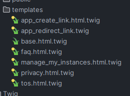

# Override Templates

To override templates from our application is simple thanks to Symfony. For the sake of this example we will override the `faq.html.twig` template.

You just have to follow these 3 simple steps:

1. Create a new directory in your project's `templates` directory (if it doesn't already exist) with the same structure as the bundle's template directory. In this case, create a directory named `streamlined` inside the `templates` directory.

2. Copy the template you want to modify from the bundle's template directory to the corresponding location in your project's `templates` directory. In this case, copy the `faq.html.twig` file from the `streamlined` bundle's template directory to `templates/streamlined/faq.html.twig`.

3. Make the necessary modifications to the copied template file in your project's `templates` directory.

We will automatically prioritize the templates in your project's `templates` directory over those in the bundle. So, when you render the `faq.html.twig` template, we will use your modified version instead of the one from the bundle.

This method allows you to override specific templates from a bundle while keeping the rest of the bundle intact in case of new updates from us.

Here is the list of all templates you can override:

