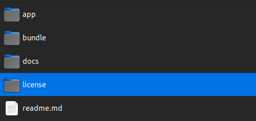

# Application

This guide will teach you how to install the application provided inside the CodeCanyon package.

:::info

This installation method requires Composer to be installed on your computer/server. If you don't have Composer installed, please follow the [official installation guide](https://getcomposer.org/doc/00-intro.md#installation-linux-unix-macos).

In case you don't want to install Composer on your computer/server, you can use the [Ready To Use](ready-to-use) package.

:::

# Download the archive

1. Visit the Codecanyon website: Go to [https://codecanyon.net/](https://codecanyon.net/) and log in to your account. 
2. Go to your Downloads page: After logging in, click on your username in the top-right corner of the page. From the dropdown menu, select "Downloads." This will take you to the Downloads page where you can access your purchased products.

3. Locate the product: On the Downloads page, you should see a list of all the products you have purchased. Find the specific product you want to download from the list.

4. Download the product: Next to the product you want to download, click on the "Download" button or the down arrow icon. This will initiate the download of the product file to your computer.

5. Verify the file: Once the download is complete, locate the downloaded file on your computer. It is often a compressed file format like ZIP or RAR. Double-check the file to ensure it matches the product you purchased and hasn't been altered.


## UnZip the archive

1. Right-click on the compressed file: Locate the downloaded file on your computer. It is often a compressed file format like ZIP or RAR. Right-click on the file.

2. Select "Extract" or "Extract Here": From the context menu that appears after right-clicking, choose the option "Extract" or "Extract Here." The specific wording may vary depending on the file extraction software you have installed on your computer.

3. Choose a destination folder (if prompted): If the extraction software asks for a destination folder, select or create a folder where you want the extracted files to be placed. You can choose any location on your computer.

4. Wait for the extraction process: The software will begin extracting the files from the compressed archive to the chosen destination folder. The time it takes will depend on the size of the archive and the performance of your computer.

5. Access the extracted files: Once the extraction is complete, navigate to the destination folder you selected. You should now see the extracted files and folders from the archive.

That's it! You have successfully unzipped the archive. You should have the following folder structure:



### Folder structure explained

- **docs** - Contains the offline documentation for the product.
- **license** - Contains the license file for the product.
- **bundle** - Contains only the bundle. Useful if you want to install the product inside an existing application.
- **app** - Contains the bundle and the application. **(This is the folder you need to upload to your server for this tutorial.)**
- **readme.md** - Contains this chapter's explanation.


## Upload the files to your server

To upload the files to your server, you will need to connect to your server using an FTP client or SSH. If you don't have an FTP client installed on your computer, you can use the free and open-source [FileZilla](https://filezilla-project.org/) client. If you don't have SSH access to your server, you can use the FTP method instead.

### Using FTP

1. Obtain FTP server details: You will need the FTP server address, username, password, and port number. These details are typically provided by your hosting provider or the administrator of the FTP server.

2. Choose an FTP client software: Select an FTP client software to establish a connection with the FTP server. Popular FTP clients include FileZilla, WinSCP, Cyberduck, and CuteFTP. These clients are available for various operating systems and can be downloaded from their respective websites.

3. Install and launch the FTP client: Download and install the chosen FTP client software on your computer. Launch the program once the installation is complete.

4. Enter the FTP server details: In the FTP client, you will find fields to enter the FTP server details. Fill in the following information:
    - FTP server address: Enter the server address provided by your hosting provider or administrator.
    - Username: Enter your FTP username.
    - Password: Enter your FTP password.
    - Port number: Enter the port number for the FTP server (usually 21 for FTP). If not provided, leave it as the default.

5. Choose the connection type: FTP clients typically offer two connection types: FTP (plain FTP) and SFTP (FTP over SSH). If you have an option, it is generally recommended to choose SFTP as it provides a more secure connection. Otherwise, choose FTP.

6. Initiate the connection: Click on the "Connect" or "Login" button in the FTP client to initiate the connection to the FTP server.

7. Navigate the remote server: Once connected, the FTP client will display the files and folders on the remote server. The remote server's file system is usually displayed on the right side of the FTP client interface, while your local file system is shown on the left.

8. Transfer files: To transfer files between your local computer and the remote server, you can drag and drop files/folders between the two file system views. You can also use the FTP client's upload and download buttons or right-click options to transfer files.

9. Drag and drop the files: Drag and drop the contents of the `app` folder to the root folder of your server. This is usually the `public_html` or `www` folder. If you are not sure, please contact your hosting provider.

### Using SSH

1. Obtain SSH server details: You will need the SSH server address, username, password (or private key), and port number. These details are typically provided by your hosting provider or the administrator of the SSH server.

2. Choose an SSH client software: Select an SSH client software to establish a connection with the SSH server. Some popular SSH clients include OpenSSH (command-line tool), PuTTY (Windows), and Terminal (macOS).

3. Launch the SSH client: Launch the chosen SSH client software on your computer. If you're using a command-line tool like OpenSSH, open a terminal or command prompt window.

4. Enter the SSH server details: In the SSH client, enter the following information:
    - SSH server address: Enter the server address provided by your hosting provider or administrator.
    - Username: Enter your SSH username.
    - Password or private key: Depending on the authentication method used by the SSH server, you may need to enter your SSH password or specify the location of your private key file.
    - Port number: Enter the port number for the SSH server (usually port 22 for SSH). If not provided, leave it as the default.

5. Initiate the SSH connection: In the SSH client or terminal, press the Enter key or click the "Connect" button to initiate the connection to the SSH server.

6. Verify server fingerprint (optional): When connecting for the first time, the SSH client may ask you to verify the server's fingerprint to ensure a secure connection. Compare the fingerprint displayed by the client with the one provided by your hosting provider or administrator. If they match, accept the fingerprint to proceed.

7. Navigate to the web server directory: Once connected to the SSH server, navigate to the directory where the web server files are located. This directory is typically the root directory or a specific folder designated for website files.

8. Upload files to the web server: Use the `scp` (secure copy) command or any built-in file transfer features of the SSH client to upload files from your local computer to the web server. The command syntax typically looks like this:

```ruby 
scp /path/to/local/file username@server:/path/to/remote/directory
```

Replace `/path/to/local/file` with the path to the file on your local computer, `username` with your SSH username, `server` with the SSH server address, and `/path/to/remote/directory` with the path to the directory on the web server where you want to upload the file.

9. Monitor file transfer progress (if applicable): Depending on the SSH client or file transfer method used, you may see a progress bar or status information indicating the file transfer progress. Wait for the transfer to complete.

10. Verify file upload: After the file transfer is complete, navigate to the web server directory where you uploaded the files and verify that the uploaded files are present.

That's it! You have successfully connected to an SSH server and uploaded files for a web server using an SSH client.


## Install the packages using composer

:::info

If you don't have Composer installed, please follow the [official installation guide](https://getcomposer.org/doc/00-intro.md#installation-linux-unix-macos).

For windows follow this [guide](https://getcomposer.org/doc/00-intro.md#installation-windows).
:::

1. Connect to the server via SSH: Establish an SSH connection to the server using an SSH client software like OpenSSH, PuTTY, or Terminal.

2. Navigate to the project directory: Use the `cd` command to navigate to the directory where your existing project is located on the server.

3. Check if Composer is installed: Run the `composer` command on the server to check if Composer is installed. If the command is not recognized, you may need to install Composer on the server. Follow the official Composer documentation or consult your server administrator for instructions on installing Composer.

4. Install the packages: Once Composer is installed, use the `composer install` command in the project directory on the server. This will read the composer.json file, resolve the package dependencies based on the composer.lock file (if present), and install the required packages. Composer will create a vendor directory where the installed packages will be stored.

5. Verify the installation: After the installation is complete, verify that the packages are installed by checking the vendor directory. You can also check the composer.lock file to see the installed packages and their versions.

That's it! You have successfully connected to an installed the required packages for the project to run.
