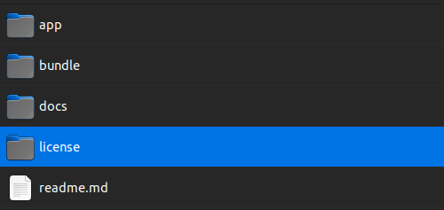

# Bundle

This guide will assume that you are a developer, and you have a basic understanding of how Symfony works.

:::info

This installation method requires Composer to be installed on your computer/server. If you don't have Composer
installed, please follow
the [official installation guide](https://getcomposer.org/doc/00-intro.md#installation-linux-unix-macos).

In case you don't want to install Composer on your computer/server, you can use the [Ready To Use](ready-to-use)
package.

:::

# Download the archive

1. Visit the Codecanyon website: Go to [https://codecanyon.net/](https://codecanyon.net/) and log in to your account.
2. Go to your Downloads page: After logging in, click on your username in the top-right corner of the page. From the
   dropdown menu, select "Downloads." This will take you to the Downloads page where you can access your purchased
   products.

3. Locate the product: On the Downloads page, you should see a list of all the products you have purchased. Find the
   specific product you want to download from the list.

4. Download the product: Next to the product you want to download, click on the "Download" button or the down arrow
   icon. This will initiate the download of the product file to your computer.

5. Verify the file: Once the download is complete, locate the downloaded file on your computer. It is often a compressed
   file format like ZIP or RAR. Double-check the file to ensure it matches the product you purchased and hasn't been
   altered.

## UnZip the archive

1. Right-click on the compressed file: Locate the downloaded file on your computer. It is often a compressed file format
   like ZIP or RAR. Right-click on the file.

2. Select "Extract" or "Extract Here": From the context menu that appears after right-clicking, choose the option "
   Extract" or "Extract Here." The specific wording may vary depending on the file extraction software you have
   installed on your computer.

3. Choose a destination folder (if prompted): If the extraction software asks for a destination folder, select or create
   a folder where you want the extracted files to be placed. You can choose any location on your computer.

4. Wait for the extraction process: The software will begin extracting the files from the compressed archive to the
   chosen destination folder. The time it takes will depend on the size of the archive and the performance of your
   computer.

5. Access the extracted files: Once the extraction is complete, navigate to the destination folder you selected. You
   should now see the extracted files and folders from the archive.

That's it! You have successfully unzipped the archive. You should have the following folder structure:



### Folder structure explained

- **docs** - Contains the offline documentation for the product.
- **license** - Contains the license file for the product.
- **bundle** - Contains only the bundle. **(This is the folder you need to upload to your server for this tutorial.)**
- **app** - Contains the bundle and the application.
- **readme.md** - Contains this chapter's explanation.

## Upload the bundle to your server

1. Upload the bundle folder anywhere inside your Symfony project. For example, you can upload it inside the `src` folder
   or in the root of your project.
2. Open `composer.json` and add the following lines at the end of the file inside the main object:

```json
        "repositories": [
{
"type": "path",
"url": "bundle/StreamlinedBundle" # must be the relative path to where your bundle is installed
}
]
```

3. Inside the `require` object, add the following line:

```json
        "wyverr/streamlined-bundle": "^1.0"
```

4. Run `composer update` to install the bundle.

6. Inside your routes.yaml file, add the following lines:

```yaml
   wyverr_streamlined_bundle:
     resource: '@StreamlinedBundle/config/routes.yaml'
```
In case you don't want to use the default routes, you can copy the content of the `routes.yaml` file and paste it inside your `routes.yaml` file.

5. Open the `config/bundles.php` file and add the following line inside the array if it doesn't exist already:

```php
    Wyverr\StreamlinedBundle\StreamlinedBundle::class => ['all' => true],
```

6. In case your assets are not installed automatically, run `php bin/console assets:install` to install them.
